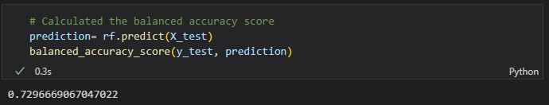
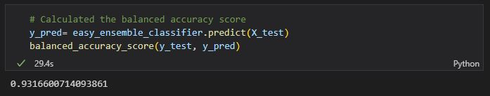

# Machine-Learning

## Overview
Using the credit card rist dataset from LendingClub, a peer-to-peer lending services company, we will predict credit risk using the imbalanced-learn and scikit-learn libraries. We are to oversample the data using RandomOverSampler and SMOTE algorithms, then undersample the data using ClusterCentroids. We will then use a combinatorial approach of over- and undersampling using the SMOTEENN algorithm. Finally, we will compare the two machine learning models that reduce bias, BalancedRandomForestClassifier and EasyEnsembleClassifier, to predict credit risk. We should then evaluate each models performance. 

## Results
During our analysis using the multiple different machine learning models, we found the following accuracy, precision, and recall scores: 

### Naive Random Oversampling
<ul>
  <li>Accuracy: 62.49%</li>
  
  <li>Precision: 99%</li>
  <li>Recall: 65%</li>
  
</ul>

### SMOTE Oversampling
<ul>
  <li>Accuracy: 65.12%</li>
  
  <li>Precision: 99%</li>
  <li>Recall: 66%</li>
  
</ul>

### Cluster Centroids
<ul>
  <li>Accuracy: 65.12%</li>
  
  <li>Precision: 99%</li>
  <li>Recall: 44%</li>
  
</ul>

### SMOTEENN
<ul>
  <li>Accuracy: 65.01%</li>
  
  <li>Precision: 99%</li>
  <li>Recall: 58%</li>
  
</ul>

### Balanced Random Forest Classifier
<ul>
  <li>Accuracy: 72.96%</li>
  
  <li>Precision: 99%</li>
  <li>Recall: 87%</li>
  
</ul>

### Ensemble Classifier
<ul>
  <li>Accuracy: 93.16%</li>
  
  <li>Precision: 99%</li>
  <li>Recall: 87%</li>
  
</ul>

## Summary

While reviewing the different models, we noticed some trends. The Precision for all of the models is at 99%, therefore each model is equivalent in precision. The Balanced Random Forest Classifier and the Ensemble Classifier both have the highest recall at 87%. Finally, the Ensemble Classifier has the highest Accuracy at 93.16%, with the Balanced Random Forest Classifier following at 72.96%. Based on these scores, the best model for this data would be the Ensemble Classifier, and the second best would be the Balanced Random Forest Classifier. 

