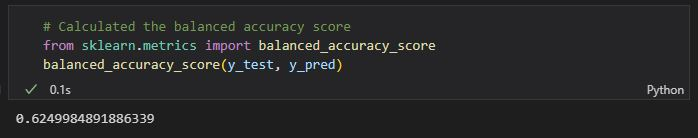
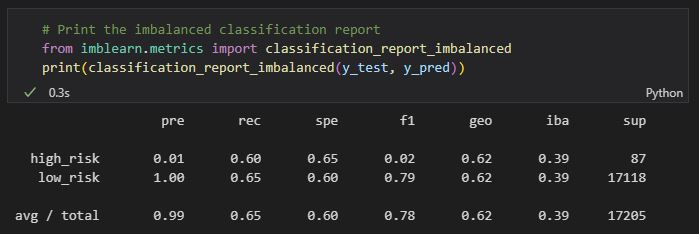
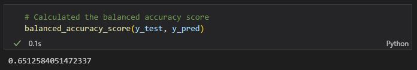
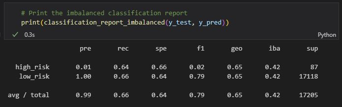
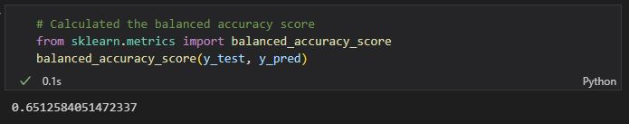
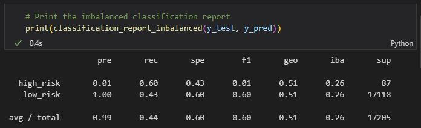
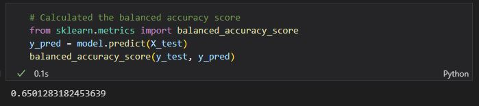
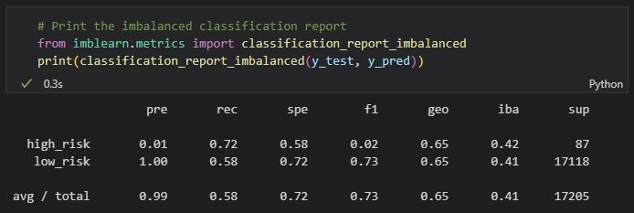
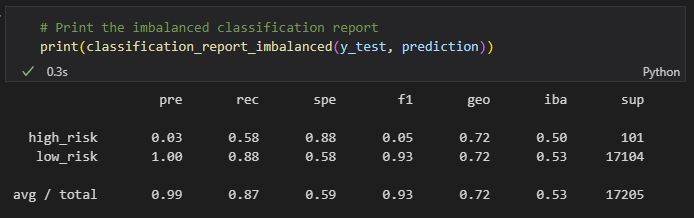
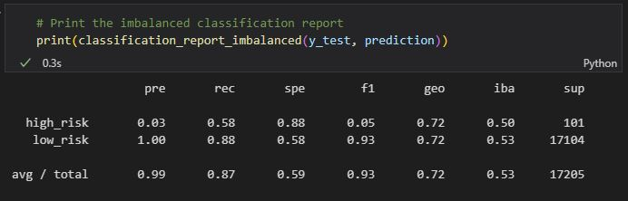

# Machine-Learning

## Overview
Using the credit card rist dataset from LendingClub, a peer-to-peer lending services company, we will predict credit risk using the imbalanced-learn and scikit-learn libraries. We are to oversample the data using RandomOverSampler and SMOTE algorithms, then undersample the data using ClusterCentroids. We will then use a combinatorial approach of over- and undersampling using the SMOTEENN algorithm. Finally, we will compare the two machine learning models that reduce bias, BalancedRandomForestClassifier and EasyEnsembleClassifier, to predict credit risk. We should then evaluate each models performance. 

## Results
During our analysis using the multiple different machine learning models, we found the following accuracy, precision, and recall scores: 

### Naive Random Oversampling
<ul>
  <li>Accuracy: 62.49%</li>
  
  <li>Precision: 99%</li>
  <li>Recall: 65%</li>
  
</ul>

### SMOTE Oversampling
<ul>
  <li>Accuracy: 62.49%</li>
  
  <li>Precision: 99%</li>
  <li>Recall: 65%</li>
  
</ul>

### Cluster Centroids
<ul>
  <li>Accuracy: 62.49%</li>
  
  <li>Precision: 99%</li>
  <li>Recall: 65%</li>
  
</ul>

### SMOTEENN
<ul>
  <li>Accuracy: 62.49%</li>
  
  <li>Precision: 99%</li>
  <li>Recall: 65%</li>
  
</ul>

### Balanced Random Forest Classifier
<ul>
  <li>Accuracy: 62.49%</li>
  
  <li>Precision: 99%</li>
  <li>Recall: 65%</li>
  
</ul>

### Ensemble Classifier
<ul>
  <li>Accuracy: 62.49%</li>
  
  <li>Precision: 99%</li>
  <li>Recall: 65%</li>
  
</ul>

## Summary

